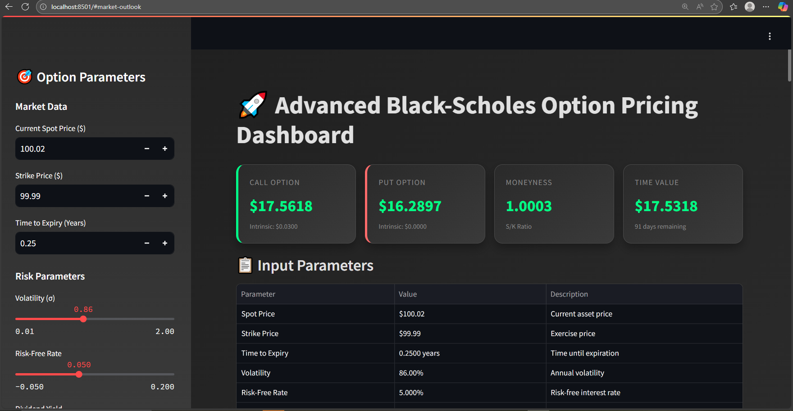
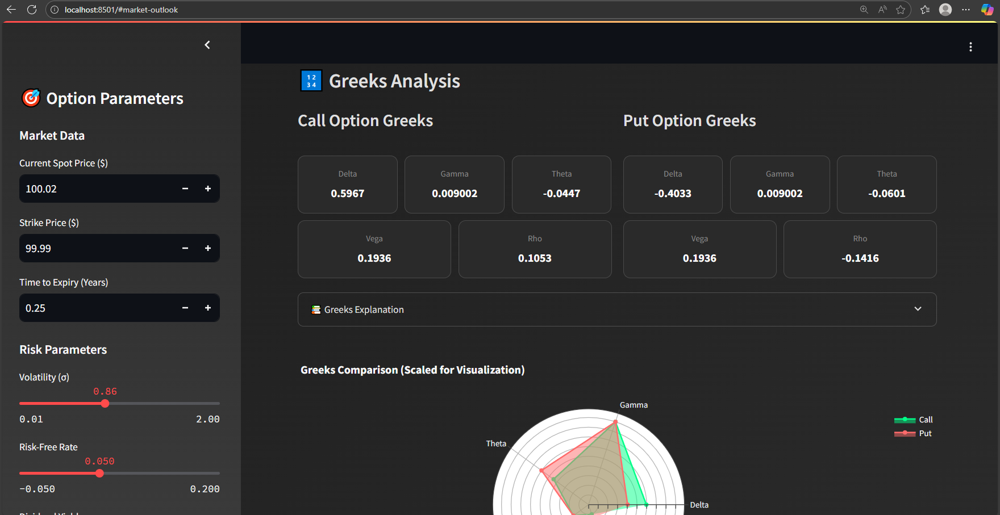
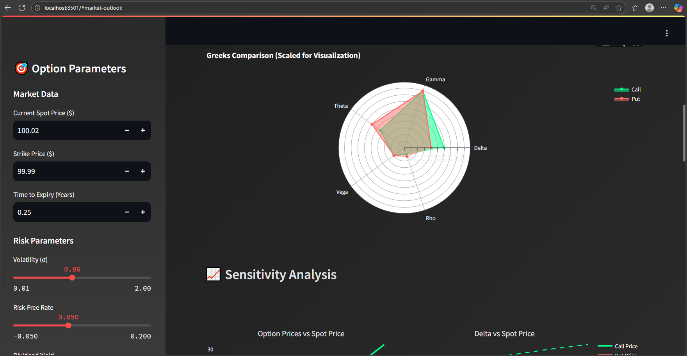
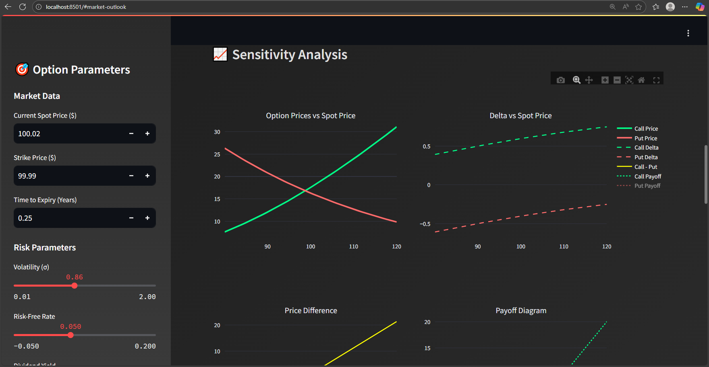
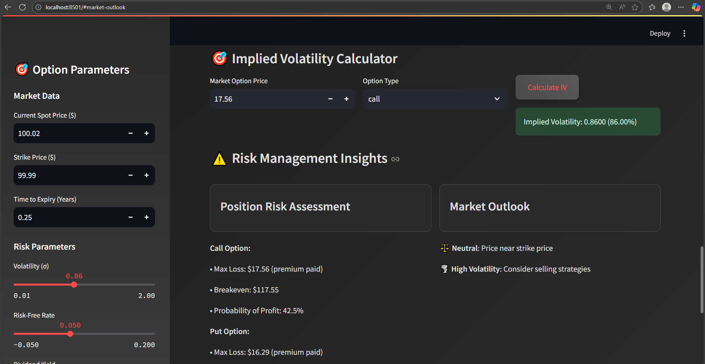
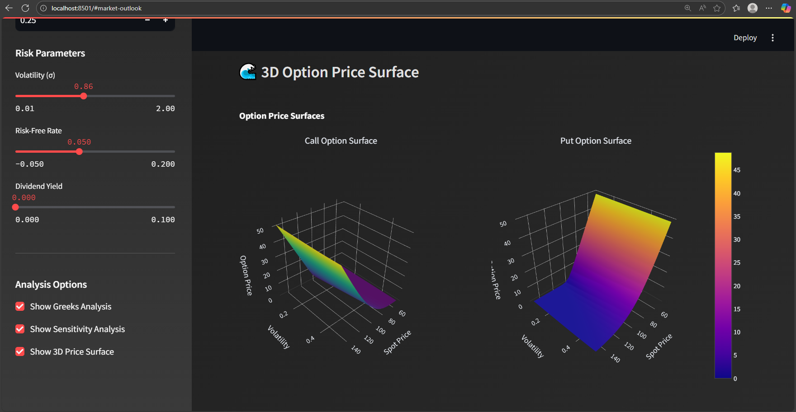
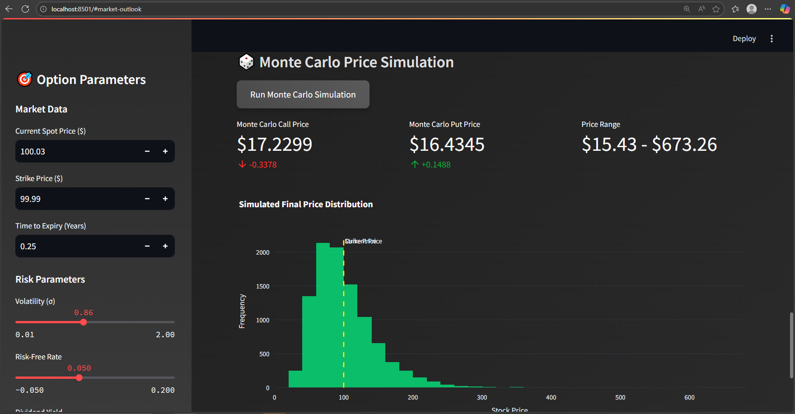

# 🚀 Advanced Black-Scholes Option Pricing Dashboard

[](https://www.python.org/downloads/)
[](https://streamlit.io/)
[](LICENSE)
[](https://github.com/your-username/advanced-blackscholes)

A comprehensive, interactive web application for **European option pricing** using the enhanced Black-Scholes-Merton model. This advanced dashboard provides real-time option valuation, Greeks calculation, sensitivity analysis, and Monte Carlo simulations with a modern, intuitive interface.


---

## 📸 Demo Preview

> Quick peek of the dashboard in action.








---


## ✨ Key Features

### 🧮 Core Functionality
- **Advanced Black-Scholes Pricing**: Enhanced implementation with dividend yield support
- **Complete Greeks Suite**: Delta, Gamma, Theta, Vega, and Rho calculations
- **Implied Volatility Calculator**: Newton-Raphson method for IV computation
- **Input Validation**: Comprehensive parameter validation with warnings

### 📊 Interactive Visualizations
- **3D Price Surfaces**: Interactive 3D plots showing option prices across spot/volatility ranges
- **Sensitivity Analysis**: Multi-panel charts showing price and Greek sensitivities
- **Greeks Radar Chart**: Comparative visualization of Greeks for calls and puts
- **Monte Carlo Simulation**: Statistical price path simulation with distribution plots

### 🎯 Risk Management Tools
- **Breakeven Analysis**: Automatic calculation of profit thresholds
- **Probability Assessment**: Statistical probability of profit calculations
- **Position Risk Metrics**: Maximum loss and risk exposure analysis
- **Market Outlook Indicators**: Automated market condition assessment

### 🎨 Modern UI/UX
- **Dark Theme**: Professional dark mode interface
- **Responsive Design**: Works seamlessly on desktop and mobile
- **Interactive Controls**: Real-time parameter adjustment with sliders
- **Gradient Styling**: Modern CSS with hover effects and animations

## 🛠️ Technology Stack

| Component | Technology | Purpose |
|-----------|------------|---------|
| **Frontend** | Streamlit | Interactive web interface |
| **Calculations** | NumPy, SciPy | Numerical computations |
| **Visualizations** | Plotly, Matplotlib | Interactive charts and plots |
| **Styling** | Seaborn, Custom CSS | Data visualization and UI |
| **Core Logic** | Custom Black-Scholes Class | Option pricing engine |

## 🚀 Quick Start

### Prerequisites
- Python 3.8 or higher
- pip package manager

### Installation

1. **Clone the repository**
   ```bash
   git clone https://github.com/your-username/advanced-blackscholes.git
   cd advanced-blackscholes
   ```

2. **Create virtual environment** (recommended)
   ```bash
   python -m venv venv
   source venv/bin/activate  # On Windows: venv\Scripts\activate
   ```

3. **Install dependencies**
   ```bash
   pip install -r requirements.txt
   ```

4. **Run the application**
   ```bash
   streamlit run app.py
   ```

5. **Access the dashboard**
   - Open your browser and navigate to `http://localhost:8501`
   - The application will automatically open in your default browser

## 📋 Requirements

```txt
streamlit>=1.28.0
pandas>=1.5.0
numpy>=1.21.0
scipy>=1.9.0
plotly>=5.15.0
matplotlib>=3.5.0
seaborn>=0.11.0
```

## 🎮 Usage Guide

### Basic Option Pricing
1. **Set Market Parameters**: Enter spot price, strike price, and time to expiry
2. **Configure Risk Parameters**: Adjust volatility, risk-free rate, and dividend yield
3. **View Results**: Call and put prices are calculated automatically
4. **Analyze Greeks**: Toggle Greeks analysis to see all risk sensitivities

### Advanced Analysis
1. **Sensitivity Analysis**: Enable to see how prices change with underlying movements
2. **3D Surface Plots**: Visualize option prices across multiple scenarios
3. **Monte Carlo Simulation**: Run statistical simulations for price forecasting
4. **Implied Volatility**: Calculate IV from market prices

### Risk Management
- **Monitor Greeks**: Use the radar chart to compare risk exposures
- **Check Probabilities**: Review probability of profit calculations
- **Assess Market Conditions**: Use the automated market outlook indicators

## 🔧 Configuration Options

### Sidebar Controls
- **Market Data**: Spot price, strike price, time to expiry
- **Risk Parameters**: Volatility (slider), interest rates, dividend yield
- **Analysis Options**: Toggle various analysis modules

### Advanced Features
- **Heatmap Configuration**: Customize price and volatility ranges
- **Simulation Parameters**: Adjust Monte Carlo settings
- **Display Options**: Choose which visualizations to show

## 📊 Model Implementation

### Enhanced Black-Scholes Formula

The core pricing model implements the Black-Scholes-Merton formula with dividends:

**Call Option:**
```
C = S₀e^(-qT)N(d₁) - Ke^(-rT)N(d₂)
```

**Put Option:**
```
P = Ke^(-rT)N(-d₂) - S₀e^(-qT)N(-d₁)
```

Where:
- `d₁ = [ln(S₀/K) + (r - q + σ²/2)T] / (σ√T)`
- `d₂ = d₁ - σ√T`

### Greeks Calculations

| Greek | Formula | Interpretation |
|-------|---------|----------------|
| **Delta** | ∂V/∂S | Price sensitivity |
| **Gamma** | ∂²V/∂S² | Delta sensitivity |
| **Theta** | ∂V/∂T | Time decay |
| **Vega** | ∂V/∂σ | Volatility sensitivity |
| **Rho** | ∂V/∂r | Interest rate sensitivity |

## 🎯 Key Improvements Over Standard Implementation

### Enhanced Features
- ✅ **Dividend Support**: Full dividend yield integration
- ✅ **Input Validation**: Comprehensive error checking and warnings
- ✅ **Implied Volatility**: Newton-Raphson IV calculation
- ✅ **Monte Carlo**: Statistical simulation capabilities
- ✅ **Modern UI**: Professional interface with dark theme

### Code Quality
- ✅ **Type Hints**: Full type annotation for better code clarity
- ✅ **Error Handling**: Robust exception handling and validation
- ✅ **Documentation**: Comprehensive docstrings and comments
- ✅ **Modular Design**: Clean separation of concerns

## 🔍 Example Use Cases

### 1. Option Valuation
```python
# Create Black-Scholes model
bs = AdvancedBlackScholes(
    spot_price=100,
    strike_price=105,
    time_to_expiry=0.25,
    volatility=0.20,
    risk_free_rate=0.05
)

# Calculate prices and Greeks
prices = bs.calculate_prices()
greeks = bs.calculate_greeks()
```

### 2. Implied Volatility
```python
# Calculate IV from market price
market_call_price = 3.50
iv = bs.implied_volatility(market_call_price, 'call')
print(f"Implied Volatility: {iv:.2%}")
```

### 3. Risk Analysis
```python
# Get comprehensive summary
summary = bs.get_summary()
print(f"Moneyness: {summary['moneyness']:.4f}")
print(f"Time Value: ${summary['time_value']['call']:.4f}")
```

## 🤝 Contributing

We welcome contributions! Here's how you can help:

1. **Fork the repository**
2. **Create a feature branch**: `git checkout -b feature/amazing-feature`
3. **Commit changes**: `git commit -m 'Add amazing feature'`
4. **Push to branch**: `git push origin feature/amazing-feature`
5. **Open a Pull Request**

### Development Guidelines
- Follow PEP 8 style guidelines
- Add type hints for new functions
- Include docstrings for public methods
- Write tests for new features
- Update documentation as needed

## 📝 License

This project is licensed under the MIT License - see the [LICENSE](LICENSE) file for details.

## 📧 Contact & Support

- **GitHub Issues**: [Report bugs or request features](https://github.com/your-username/advanced-blackscholes/issues)
- **Email**: your.email@example.com
- **LinkedIn**: [Your LinkedIn Profile](https://linkedin.com/in/your-profile)

## 🙏 Acknowledgments

- **Black-Scholes Model**: Fischer Black, Myron Scholes, and Robert Merton
- **Streamlit Team**: For the amazing web framework
- **SciPy Community**: For numerical computation tools
- **Open Source Contributors**: Thanks to all who contribute to the libraries used

## ⚠️ Disclaimer

This application is for **educational and research purposes only**. It should not be used as the sole basis for making financial decisions. Always consult with qualified financial professionals before making investment decisions. The authors are not responsible for any financial losses incurred through the use of this software.

---

<div align="center">
  <p><strong>Built with ❤️ by Saakshi Dedhia for the finance and technology community</strong></p>
  <p>If you find this project useful, please consider giving it a ⭐ on GitHub!</p>
</div>

